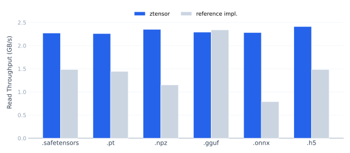
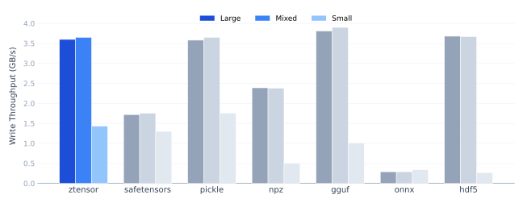

# ztensor
[](https://crates.io/crates/ztensor)
[](https://docs.rs/ztensor)
[](https://pypi.org/project/ztensor/)
[](https://opensource.org/licenses/MIT)

Unified, zero-copy, and safe I/O for deep learning formats.

## Reading

zTensor reads `.safetensors`, `.pt`, `.gguf`, `.npz`, `.onnx`, `.h5`, and `.zt` files through a single API. Format detection is automatic. In zero-copy mode, it consistently achieves ~2 GB/s across all formats. For `.pt` files, it parses pickle using a restricted VM in Rust that only extracts tensor metadata, so no arbitrary code can execute.

<p align="center">
  
</p>

| Format | zTensor | zTensor (zc off) | Reference impl. |
| :--- | :--- | :--- | :--- |
| .zt | **2.19 GB/s** | 1.37 GB/s | n/a |
| .safetensors | **2.19 GB/s** | 1.46 GB/s | 1.33 GB/s ([safetensors](https://github.com/huggingface/safetensors)) |
| .pt | **2.04 GB/s** | 1.33 GB/s | 0.89 GB/s ([torch](https://github.com/pytorch/pytorch)) |
| .npz | **2.11 GB/s** | 1.41 GB/s | 1.04 GB/s ([numpy](https://github.com/numpy/numpy)) |
| .gguf | **2.11 GB/s** | 1.38 GB/s | 1.39 GB/s / 2.15 GB/s† ([gguf](https://github.com/ggml-org/ggml)) |
| .onnx | **2.07 GB/s** | 1.29 GB/s | 0.76 GB/s ([onnx](https://github.com/onnx/onnx)) |
| .h5 | **1.96 GB/s** | 1.30 GB/s | 1.35 GB/s ([h5py](https://github.com/h5py/h5py)) |

*Llama 3.2 1B shapes (~2.8 GB). Linux, NVMe SSD, median of 5 runs, cold reads. ONNX at 1 GB (protobuf limit). †GGUF's native reader also supports mmap (2.15 GB/s). See [Benchmarks](https://pie-project.github.io/ztensor/benchmarks) for details.*

## Writing

zTensor writes exclusively to `.zt`, our own format. Existing tensor formats each solve part of the problem, but none solve it cleanly:

- **Pickle-based formats** (`.pt`, `.bin`) execute arbitrary code on load; a model file can run anything on the reader's machine.
- **SafeTensors** is safe but treats every tensor as a flat, dense array of a fixed dtype. New formats can't be represented without a spec change.
- **GGUF** handles quantization but bakes each scheme into the dtype enum, coupling the format to the llama.cpp ecosystem.
- **NumPy `.npz`** has no alignment guarantees (no mmap), no compression beyond zip, and no structured metadata.

Most formats equate "tensor" with "flat array of one dtype." Once you need something structurally richer (sparse indices alongside values, or quantized weights alongside scales), the format can't express it without flattening into separate arrays held together by naming conventions.

`.zt` models each tensor as a composite object with typed components, so dense, sparse, and quantized data all fit without extending the format. It also supports zero-copy mmap reads, zstd compression, integrity checksums, and streaming writes. Read the full [specification](https://pie-project.github.io/ztensor/spec).

<p align="center">
  
</p>

| Format | Large | Mixed | Small |
| :--- | :--- | :--- | :--- |
| **.zt** | 3.62 GB/s | 3.65 GB/s | 1.42 GB/s |
| .safetensors | 1.72 GB/s | 1.77 GB/s | 1.48 GB/s |
| .pt (pickle) | 3.62 GB/s | 3.68 GB/s | **2.00 GB/s** |
| .npz | 2.40 GB/s | 2.40 GB/s | 0.51 GB/s |
| **.gguf** | **3.85 GB/s** | **3.86 GB/s** | 1.06 GB/s |
| .onnx | 0.28 GB/s | 0.29 GB/s | 0.32 GB/s |
| .h5 | 3.67 GB/s | 3.69 GB/s | 0.27 GB/s |

*Three workloads at 512 MB, `copy=True`: Large (few big matrices), Mixed (realistic model shapes), Small (many ~10 KB parameters). See [Benchmarks](https://pie-project.github.io/ztensor/benchmarks) for details.*

## Format Comparison

| Feature | .zt | .safetensors | .gguf | .pt (pickle) | .npz | .onnx | .h5 |
| :--- | :---: | :---: | :---: | :---: | :---: | :---: | :---: |
| Zero-copy read | ✓ | ✓ | ✓ | ~² | ~² | | |
| Safe (no code exec) | ✓ | ✓ | ✓ | | ✓ | ✓ | ✓ |
| Streaming / append | ✓ | | | | ~³ | | ✓ |
| Sparse tensors | ✓ | | | ✓ | | | |
| Per-tensor compression | ✓ | | | | ✗¹ | | ✓ |
| Extensible types | ✓ | | | N/A | | ✓ | ✓ |

¹ `.npz` uses archive-level zip/deflate, not per-tensor compression.
² Partial support (requires specific alignment or uncompressed data).
³ Zip append support (not standard API).

## Installation

```bash
pip install ztensor           # Python
cargo add ztensor              # Rust
cargo install ztensor-cli     # CLI
```

## Documentation

- [Website](https://pie-project.github.io/ztensor/) — guides, API reference, benchmarks
- [docs.rs](https://docs.rs/ztensor) — Rust API docs

## License

MIT
