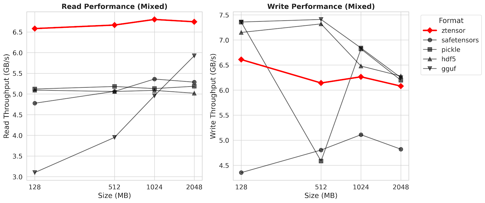

# ztensor
[](https://crates.io/crates/ztensor)
[](https://docs.rs/ztensor)
[](https://pypi.org/project/ztensor/)
[](https://opensource.org/licenses/MIT)

Simple tensor serialization format

## Key Features

- **Simple Spec** — Minimalist [spec](SPEC.md) for easy parsing.
- **Zero-Copy Access** — Instant memory-mapping (mmap) with no extra RAM copying overhead.
- **Efficient Writes** — Supports streaming and append-only operations without rewriting files.
- **Future-Proof** — Decouples physical storage from logical representation for long-term compatibility.

## Tools

- **Rust Core** — High-performance, SIMD-aligned implementation.
- **Python API** — First-class bindings for **NumPy** and **PyTorch**.
- **Universal Converters** — CLI tools to convert **SafeTensors**, **GGUF**, **Pickle**, **NumPy (.npz)**, **ONNX**, and **HDF5** files.

## Comparison

| Feature | **zTensor** | SafeTensors | GGUF | Pickle | HDF5 |
| :--- | :---: | :---: | :---: | :---: | :---: |
| **Zero-Copy Read** | ✅ | ✅ | ✅ | ❌ | ⚠️ |
| **Safe (No Exec)** | ✅ | ✅ | ✅ | ❌ | ✅ |
| **Streaming / Append** | ✅ | ❌ | ❌ | ❌ | ✅ |
| **Sparse Tensors** | ✅ | ❌ | ❌ | ✅ | ✅ |
| **Compression** | ✅ | ❌ | ❌ | ❌ | ✅ |
| **Quantization** | ✅ | ✅ | ✅ | ✅ | ✅ |
| **Parser Complexity** | 🟢 Low | 🟢 Low | 🟡 Med | 🔴 High | 🔴 High |

## Benchmark



See [benchmark](benchmark/bench.py) for more details.

## Installation

### Python

```bash
pip install ztensor
```

See the [Python docs](https://pie-project.github.io/ztensor/python) for the full API reference.

### Rust

```toml
[dependencies]
ztensor = "1.2"
```

See the [Rust docs](https://pie-project.github.io/ztensor/rust) or [docs.rs](https://docs.rs/ztensor) for the full API reference.

### CLI

```bash
cargo install ztensor-cli
```

See the [CLI docs](https://pie-project.github.io/ztensor/cli) for usage details.

## Supported Data Types

| Type | Description |
|------|-------------|
| `float32`, `float16`, `bfloat16`, `float64` | Floating point |
| `int8`, `int16`, `int32`, `int64` | Signed integers |
| `uint8`, `uint16`, `uint32`, `uint64` | Unsigned integers |
| `bool` | Boolean |

## File Format

See [SPEC.md](SPEC.md) for the complete specification.

## License

MIT
