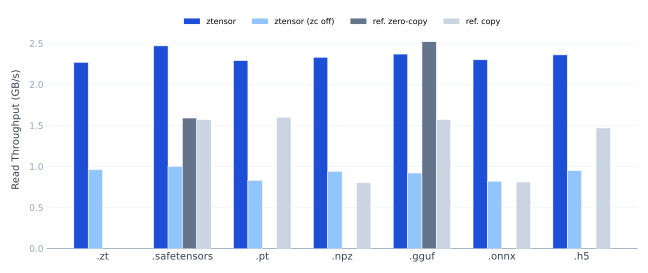
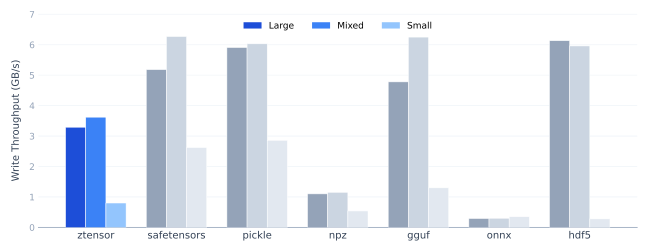

# zTensor

An aligned, verifiable container format for tensor data — and one loader
that reads every other tensor format into the same object model.

**Crates 2.0.0 · Format `.zt` version 2 · Spec Draft 2**

*The crate version and the format version are not the same number and do not
move together — 2.0 happens to be both because the API was rewritten while the
container stayed frozen. A `.zt` file written by any 1.x release is read by 2.0
unchanged.*

```rust
// Read anything: .zt, .safetensors, .gguf, .npz, .pt, .h5, .onnx
let src = ztensor_compat::open("model.safetensors")?;
let t = src.tensor("layer.weight")?;
let bytes = t.map()?;                  // borrowed, or an error — never a hidden copy

// Write one thing: a canonical, digest-carrying .zt file
let mut w = ztensor::Writer::create("model.zt")?;
w.ingest(&src)?;
w.finish()?;
```

```bash
zt ls model.gguf                    # inspect anything
zt convert model.gguf model.zt      # canonical, verifiable output
zt verify model.zt --deep           # structure + digests + shards
zt diff a.safetensors b.zt          # compare across formats
```

## What `.zt` gives you

- **64 KiB placement** in canonical files, so every tensor starts on a page
  boundary on every platform in use (4 KiB, 16 KiB, 64 KiB pages). Each
  tensor can be mapped, registered, and evicted independently — which is
  what makes weight streaming possible without disturbing neighbours.
- **Verifiability**: an XXH3 digest per tensor, plus one over the manifest
  itself. Corruption is an error, not a wrong answer.
- **Extensibility without version churn**: quantization schemes, sparse
  layouts, and compression are versioned *profiles* in a registry, not
  cases baked into the container. Unknown vocabulary is refused, never
  guessed at.
- **Reproducibility**: two canonical writes of the same tensors produce
  byte-identical files, so a file hash is a stable model identity.
- **No code execution** anywhere in the format.

## Reading

zTensor reads `.safetensors`, `.pt`, `.gguf`, `.npz`, `.onnx`, `.h5`, and `.zt`
through a single API. Format detection is automatic. In zero-copy mode it
reaches ~2.3 GB/s across every format, because every format ends up as the same
thing: a mapped byte range described by one object model. For `.pt` files it
parses pickle with a restricted VM that only extracts tensor metadata, so no
arbitrary code can execute.

<p align="center">
  
</p>

| Format | zTensor | zTensor (zc off) | Reference impl. |
| :--- | :--- | :--- | :--- |
| .zt | **2.27 GB/s** | 0.96 GB/s | n/a |
| .safetensors | **2.47 GB/s** | 1.00 GB/s | 1.57 GB/s / 1.59 GB/s† ([safetensors](https://github.com/huggingface/safetensors)) |
| .pt | **2.29 GB/s** | 0.83 GB/s | 1.60 GB/s ([torch](https://github.com/pytorch/pytorch)) |
| .npz | **2.33 GB/s** | 0.94 GB/s | 0.80 GB/s ([numpy](https://github.com/numpy/numpy)) |
| .gguf | 2.37 GB/s | 0.92 GB/s | 1.57 GB/s / **2.52 GB/s**† ([gguf](https://github.com/ggml-org/ggml)) |
| .onnx | **2.30 GB/s** | 0.82 GB/s | 0.81 GB/s ([onnx](https://github.com/onnx/onnx)) |
| .h5 | **2.36 GB/s** | 0.95 GB/s | 1.47 GB/s ([h5py](https://github.com/h5py/h5py)) |

*Measured on the 1.x read path and re-verified against 2.0 (see
[Benchmarks](website/docs/benchmarks.md#a-note-on-the-20-rewrite)); Llama 3.2 1B
shapes (~2.8 GB). Linux, i9-13900K, NVMe SSD, median of 5 runs, cold reads. ONNX at 1 GB (protobuf limit). †Native zero-copy where available
(GGUF mmap, SafeTensors `safe_open`). See
[Benchmarks](website/docs/benchmarks.md) for details.*

## Writing

zTensor writes exclusively to `.zt`. Existing tensor formats each solve part of
the problem, but none solve it cleanly:

- **Pickle-based formats** (`.pt`, `.bin`) execute arbitrary code on load; a
  model file can run anything on the reader's machine.
- **SafeTensors** is safe but packs tensors back to back, so essentially none of
  them begin on a page — a weight cannot be mapped, registered, or evicted
  without dragging its neighbours along.
- **GGUF** handles quantization but bakes each scheme into the dtype enum,
  coupling the format to one ecosystem.
- **NumPy `.npz`** has no alignment guarantees, no per-tensor compression, and
  no structured metadata.
- **None of them** carry a digest, so a corrupt byte surfaces as a wrong answer
  rather than an error.

`.zt` models each tensor as a composite object with typed parts, so dense,
sparse and quantized data all fit without extending the format; it places every
tensor on a page boundary, carries an XXH3 digest per tensor and one over the
manifest, and is byte-reproducible. Read the full
[specification](spec/ztensor-v2-spec.md).

<p align="center">
  
</p>

| Format | Large | Mixed | Small |
| :--- | :--- | :--- | :--- |
| **.zt** | 3.29 GB/s | 3.62 GB/s | 0.80 GB/s |
| .safetensors | 5.18 GB/s | **6.27 GB/s** | 2.62 GB/s |
| .pt (pickle) | 5.91 GB/s | 6.03 GB/s | **2.86 GB/s** |
| .npz | 1.10 GB/s | 1.15 GB/s | 0.54 GB/s |
| .gguf | 4.78 GB/s | 6.25 GB/s | 1.30 GB/s |
| .onnx | 0.29 GB/s | 0.30 GB/s | 0.35 GB/s |
| **.h5** | **6.13 GB/s** | 5.96 GB/s | 0.28 GB/s |

*Three workloads at 512 MB: Large (few big matrices), Mixed (realistic model
shapes), Small (many ~10 KB parameters). zTensor writes canonical form here —
64 KiB placement, a digest per tensor, and a file that is byte-identical across
runs. On `Small` that means 51k tiny tensors each rounded up to a page: the file
is 6.4× the payload and the write pays for all of it. Writing the same workload
at the 4 KiB floor gives 1.32 GB/s into 1.21× — see
[Benchmarks](website/docs/benchmarks.md#alignment-is-a-tradeoff).*

## Format comparison

| Feature | .zt | .safetensors | .gguf | .pt (pickle) | .npz | .onnx | .h5 |
| :--- | :---: | :---: | :---: | :---: | :---: | :---: | :---: |
| Zero-copy read | ✓ | ✓ | ✓ | ~² | ~² | | |
| Page-aligned tensors | ✓ | | | | | | |
| Per-tensor digest | ✓ | | | | | | |
| Safe (no code exec) | ✓ | ✓ | ✓ | | ✓ | ✓ | ✓ |
| Streaming / append | ✓ | | | | ~³ | | ✓ |
| Sparse tensors | ✓ | | | ✓ | | | |
| Per-tensor compression | ✓ | | | | ✗¹ | | ✓ |
| Extensible types | ✓ | | | N/A | | ✓ | ✓ |
| Byte-reproducible | ✓ | | | | | | |

¹ `.npz` uses archive-level zip/deflate, not per-tensor compression.
² Partial support (requires specific alignment or uncompressed data).
³ Zip append support (not standard API).

## Platform support

Developed and tested on **Linux and macOS**, which is what CI runs. The crate
carries no unix-only dependency and its non-unix code path is compiled on every
push (against `wasm32-wasip1`, the cheapest non-unix target) and its behaviour
tested on unix against the platform path it replaces — but **Windows is not
tested**, and until it is, treat it as unverified rather than supported.

Two capabilities are unix-only by nature and simply do not exist elsewhere:
`prefetch` (`madvise(WILLNEED)`) and `evict` (`madvise(DONTNEED)`). Everything
else — reading, writing, mapping, addressing, verification — is portable.

## Upgrading from 1.x

The container did not change: a `.zt` written by any 1.x release opens in 2.0
unchanged. The crate surface did — [CHANGELOG.md](CHANGELOG.md) records what
moved and why.

## Layout of this repository

| Path | What it is |
| --- | --- |
| `spec/` | The 646-line normative specification and 4 profile documents |
| `ztensor/` | Core crate: reader, writer, validation, sharding |
| `ztensor-compat/` | Foreign-format projections (feature-gated per format) |
| `ztensor-cli/` | The `zt` binary |
| `ztensor-py/` | Python bindings (abi3, Python ≥ 3.9) |
| `conformance/` | Golden corpus: 18 files a reader must accept, 52 it must reject |
| `fuzz/` | cargo-fuzz targets: container, CBOR codec, and all six parsers |
| `benchmark/` | The harness behind the numbers above |
| `website/docs/` | Documentation sources |

The core crate's entire dependency list is `memmap2`, `xxhash-rust`,
`unicode-normalization`, and `libc` — plus optional `zstd` for the
seekable-compression profile. The CBOR codec is 418 lines in-tree
(excluding its tests),
because the spec restricts CBOR hard enough (no tags, 8 value types,
deterministic encoding mandatory) that owning it is smaller than depending
on a general one — and it lets determinism be structural rather than
optional.

## Three layers, three lifetimes

The format separates what must never change from what is expected to:

| Layer | Contents | Contract |
| --- | --- | --- |
| **L0 — Container** | Magic, 40-byte footer, aligned blob heap, byte order | **Frozen** |
| **L1 — Manifest** | Deterministic-CBOR schema | Gated by the footer's version integer |
| **L2 — Vocabulary** | Layouts, logical types, encodings, digests | **Deliberately mortal**, registry-managed |

A minimal conforming reader is `ztensor/examples/minimal_reader.rs` — 68
lines, needing only a CBOR decoder and XXH3.

## The capability ladder

Formats differ in what they can guarantee, and the API says so instead of
pretending otherwise:

| Tier | Guarantee | Where |
| --- | --- | --- |
| `bytes()` | decoded bytes, and it says whether they were borrowed or copied | every format |
| `map()` | a borrow, or an error — never a hidden copy | mapped raw parts |
| `locate()` | the exact range of one file, for a caller doing its own I/O | raw parts |
| `verify()` | a digest check | `.zt` |
| `evict()` | drops these pages without touching a neighbour's | page-exclusive parts |

`caps()` reports, per part, which of those will work — and every field is
named after the method it gates, computed by that method's own precondition,
so the report cannot drift from the behaviour. Converting a foreign checkpoint
is how you get the ones it cannot offer.

## Supported formats

| Format | Cargo feature | Notes |
| --- | --- | --- |
| `.zt` | — | Native, including sharded models and overlays |
| `.safetensors` | `safetensors` (default) | Exact-tiling validation defuses header aliasing |
| `.gguf` | `gguf` (default) | Quantized blocks kept verbatim as `gguf.<type>/1` |
| `.npz` / `.npy` | `npz` | Big-endian and Fortran-order arrays are refused, not reinterpreted |
| `.pt` / `.bin` | `pickle` | Restricted VM, no code execution; non-contiguous tensors refused |
| `.h5` / `.hdf5` | `hdf5` | Contiguous and chunked, deflate + shuffle filters |
| `.onnx` | `onnx` | Graph initializers; external data refused |

Reading is many-to-one by design: writing is `.zt` only. Tracking every
foreign format as a *producer* is unbounded work that no consumer needs.

`pickle` is opt-in because parsing pickle at all is a larger attack
surface than anything else here.

## Testing

79 tests, a 70-file conformance corpus that is the CI gate, and three
fuzz targets. The parsers consume untrusted files, so the contract they
are held to is explicit: hostile input yields an error — never a panic, an
unbounded allocation, or a fabricated tensor. `ztensor-compat/tests/hostile.rs`
pins that with the reproducers behind each hardening fix.

```bash
cargo test --all-features
cargo run -p conformance --bin gen        # regenerate golden files
cargo +nightly fuzz run fuzz_compat       # foreign-format parsers
```

## Status

Pre-1.0 in intent if not in number: the format is Draft 2 and may still
change. The crate line continues from the 1.2.x series, but this is a
complete rewrite — the API, the file format, and the guarantees are all
new, and `.zt` v2 files are not readable by 1.2.x.

## Documentation

- [Format specification](spec/ztensor-v2-spec.md)
- [Profile registry](spec/profiles/)
- [Guide](website/docs/guide.md)
- [Benchmarks](website/docs/benchmarks.md)

## License

MIT
