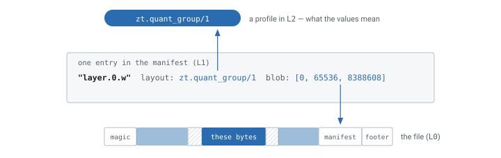

# zTensor

zTensor is two things:

1. **A container format** (`.zt`) for tensor data — aligned, verifiable,
   and designed so that the parts of it that must never change are
   separated from the parts that are expected to.
2. **A universal loader** — one API that reads `.safetensors`, `.gguf`,
   `.npz`, PyTorch `.pt`, HDF5, and ONNX by projecting each into the same
   object model, and writes exactly one format: canonical `.zt`.

```rust
use ztensor::{Source, Writer};

// Read anything.
let src = ztensor_compat::open("model.safetensors")?;
for t in src.tensors() {
    println!("{}: {:?} {}", t.name(), t.shape(), t.layout());
}

// Write one thing: a canonical, digest-carrying .zt file.
let mut w = Writer::create("model.zt")?;
w.ingest(&src)?;
w.finish()?;
```

## What a `.zt` file is


## Why another format

The formats in use today each gave up something that matters for serving
large models:

- **Alignment.** safetensors packs tensors back to back, so a tensor
  rarely starts on a page boundary. You cannot map, register, or evict one
  tensor without touching its neighbours.
- **Extensibility.** GGUF encodes each quantization scheme into the
  container itself, so every new scheme is a format change.
- **Safety.** `.pt` is pickle: reading it is executing it.
- **Verifiability.** None of them carry per-tensor digests, so a corrupt
  byte surfaces as a wrong answer rather than an error.

`.zt` fixes those without inventing a new problem: 64 KiB placement in
canonical files, a vocabulary of versioned profiles instead of built-in
quantization, no code execution anywhere, and an XXH3 digest per tensor
plus one over the manifest.


The page is the unit the operating system deals in, so it is also the unit
of ownership. A tensor whose pages are its own can be mapped, registered
with a driver, and dropped from the cache without touching anything else.

## The three layers

The format is organized so that the mortal parts can die without taking
the rest with them:


They meet in one place. A manifest entry says what a tensor *means* by
naming a profile from L2, and says where it *is* by naming a byte range in
L0 — so the layer that is allowed to change never touches the layer that
is not.



Refusing unknown L2 vocabulary is not a limitation, it is the point:
silently reinterpreting it is how a format produces wrong tensors instead
of errors.

See the [format specification](./spec.md) for the normative rules and
[profiles](https://github.com/pie-project/ztensor/tree/main/spec/profiles)
for the registry.

## One model, several files

A blob reference begins with a shard index, so a manifest can address bytes
in files other than its own. That is all sharding is — and because the
shard table records **size and digest rather than a name**, moving or
renaming the files cannot break or silently change a model.


The same mechanism is how an overlay works: a LoRA stores only its deltas
and points at the base model's blobs, without copying them.

## The capability ladder

Different files support different things, and the API says so rather than
pretending otherwise:

| Operation | What it gives you | Where it works |
| --- | --- | --- |
| `bytes()` | decoded bytes, saying whether they were borrowed or copied | every format |
| `map()` | a borrow, or an error | mapped raw parts |
| `locate()` | the exact range of one file, for your own I/O | raw parts |
| `verify()` | a digest check | `.zt` |
| `evict()` | drops these pages without touching a neighbour's | page-exclusive parts |

`caps()` reports which of those will work, per part, and `map()` returns an
error rather than silently falling back to a copy. To get what a foreign
checkpoint cannot offer, convert it — that is what `ingest` is for.

## Getting started

```bash
cargo add ztensor            # the format
cargo add ztensor-compat     # foreign-format projections
pip install ztensor          # Python bindings
```

```bash
zt ls model.gguf                    # inspect anything
zt convert model.gguf model.zt      # canonical, verifiable output
zt verify model.zt --deep           # structure + digests + shards
zt diff a.safetensors b.zt          # compare across formats
```
