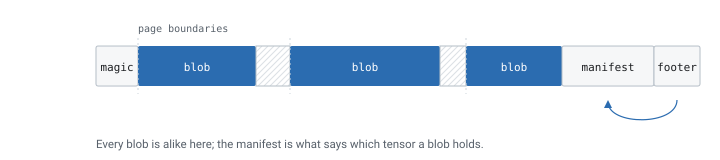
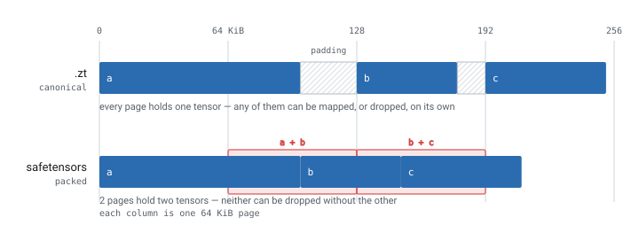
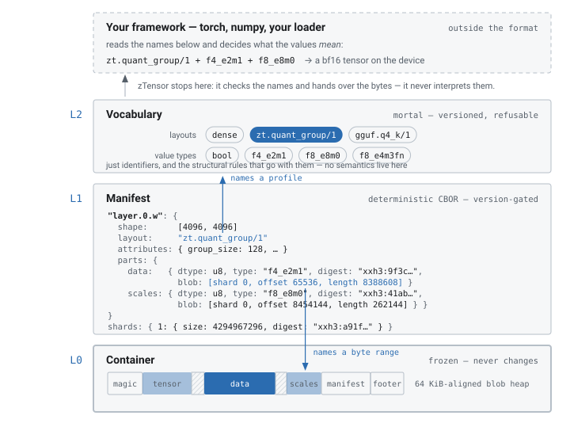
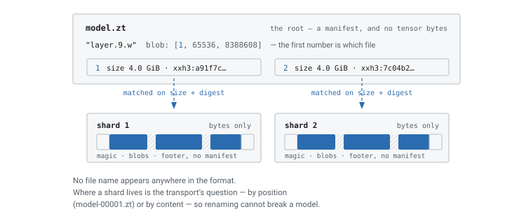

# zTensor

zTensor is two things:

1. **A container format** (`.zt`) for tensor data. Tensors are aligned and
   carry digests, and the format keeps its frozen parts separate from the
   parts that are expected to change.
2. **A universal loader**. One API reads `.safetensors`, `.gguf`, `.npz`,
   PyTorch `.pt`, HDF5 and ONNX by projecting each into the same object
   model. It writes one format: canonical `.zt`.

```rust
use ztensor::{Source, Writer};

// Read anything.
let src = ztensor_compat::open("model.safetensors")?;
for t in src.tensors() {
    println!("{}: {:?} {}", t.name(), t.shape(), t.layout());
}

// Write one thing: a canonical, digest-carrying .zt file.
let mut w = Writer::create("model.zt")?;
w.ingest(&src)?;
w.finish()?;
```

## What a `.zt` file is



The last 40 bytes point at the manifest, and the manifest gives the location
of every tensor.


## Why another format

Each of the formats in common use gives up something that matters when
serving large models:

- **Alignment.** safetensors packs tensors back to back, so a tensor
  rarely starts on a page boundary. You cannot map, register, or evict one
  tensor without touching its neighbours.
- **Extensibility.** GGUF encodes each quantization scheme into the
  container itself, so every new scheme is a format change.
- **Safety.** `.pt` is pickle, so reading a file executes whatever code it
  contains.
- **Verifiability.** None of them carry per-tensor digests, so a corrupt
  byte surfaces as a wrong answer rather than an error.

### What `.zt` does instead

Canonical `.zt` files place tensors on 64 KiB boundaries. Quantization
schemes live in a registry of versioned profiles instead of the container.
Nothing in the format executes code. Every tensor carries an XXH3 digest, and
so does the manifest.



The page is the unit the operating system works in. A tensor that has its
pages to itself can be mapped, registered with a driver, and dropped from
the cache without affecting anything else.

## The three layers

The format separates the parts that are frozen from the parts that are
expected to change:



A manifest entry gives a tensor's location as a byte range in L0, and its
meaning as a profile name in L2. Adding a profile to L2 does not change L1
or L0.

### How L2 names are handled

zTensor checks an L2 name against its registry and passes it through. It
does not act on it. Working out that `zt.quant_group/1` with an `f4_e2m1`
payload and `f8_e8m0` scales dequantizes to bf16 is the framework's job.

An unregistered name is an error. If zTensor guessed instead, it would
hand back a tensor that looks fine and holds the wrong numbers.

See the [format specification](./spec.md) for the normative rules and
[profiles](https://github.com/pie-project/ztensor/tree/main/spec/profiles)
for the registry.

## One model, several files

A part may name a shard, which lets a manifest address bytes in files other
than its own. That is all sharding is. A part that names no shard lives in
the containing file, so a single-file model never mentions sharding at all.

The name is only a label. The shard table records size and digest, so moving
or renaming the files cannot break a model or silently change it.



### Overlays

Overlays use the same mechanism. A LoRA stores only its deltas and points at
the base model's blobs instead of copying them.

## Performance

*Llama 3.2 1B shapes (~2.8 GB), Linux, i9-13900K, NVMe SSD, median of 5 runs.
[Benchmarks](./benchmarks.md) has the method, the charts and the analysis.*

### Reading

One mmap-backed API across every format, compared against each format's own
library.

| Source format | zTensor | zTensor (zc off) | Reference impl. |
|---|---|---|---|
| **.zt** | **2.27 GB/s** | 0.96 GB/s | n/a |
| **.safetensors** | **2.47 GB/s** | 1.00 GB/s | 1.57 GB/s / 1.59 GB/s† ([`safetensors`](https://github.com/huggingface/safetensors)) |
| **.pt** | **2.29 GB/s** | 0.83 GB/s | 1.60 GB/s ([`torch`](https://github.com/pytorch/pytorch)) |
| **.npz** | **2.33 GB/s** | 0.94 GB/s | 0.80 GB/s ([`numpy`](https://github.com/numpy/numpy)) |
| **.gguf** | 2.37 GB/s | 0.92 GB/s | 1.57 GB/s / **2.52 GB/s**† ([`gguf`](https://github.com/ggml-org/ggml)) |
| **.onnx** | **2.30 GB/s** | 0.82 GB/s | 0.81 GB/s ([`onnx`](https://github.com/onnx/onnx)) |
| **.h5** | **2.36 GB/s** | 0.95 GB/s | 1.47 GB/s ([`h5py`](https://github.com/h5py/h5py)) |

*ONNX measured at 1 GB (protobuf caps a message at 2 GB). †Native zero-copy
where available (GGUF mmap, SafeTensors `safe_open`).*

### Writing

Each format written by its own reference implementation, three workloads at
512 MB: **Large** (few big matrices), **Mixed** (realistic model shapes),
**Small** (many ~10 KB parameters).

| Format | Large | Mixed | Small |
|---|---|---|---|
| **ztensor** | 3.29 GB/s | 3.62 GB/s | 0.80 GB/s |
| safetensors | 5.18 GB/s | **6.27 GB/s** | 2.62 GB/s |
| pickle | 5.91 GB/s | 6.03 GB/s | **2.86 GB/s** |
| npz | 1.10 GB/s | 1.15 GB/s | 0.54 GB/s |
| gguf | 4.78 GB/s | 6.25 GB/s | 1.30 GB/s |
| onnx | 0.29 GB/s | 0.30 GB/s | 0.35 GB/s |
| hdf5 | **6.13 GB/s** | 5.96 GB/s | 0.28 GB/s |

zTensor is not the fastest writer, because it is not writing the same file.
A canonical write hashes every byte, pads to 64 KiB and shares blobs between
identical tensors. You pay that once when the artifact is written, not on
each load.

## The capability ladder

Different files support different operations, and the API reports which:

| Operation | What it gives you | Where it works |
| --- | --- | --- |
| `bytes()` | decoded bytes, saying whether they were borrowed or copied | every format |
| `map()` | a borrow, or an error | mapped raw parts |
| `locate()` | the exact range of one file, for your own I/O | raw parts |
| `verify()` | a digest check | `.zt` |
| `evict()` | drops these pages without touching a neighbour's | page-exclusive parts |

`caps()` reports which of these will work for a given part. `map()` returns
an error instead of falling back to a copy. If a foreign checkpoint does not
support what you need, convert it with `ingest`.

## Getting started

### Install

```bash
cargo add ztensor            # the format
cargo add ztensor-compat     # foreign-format projections
pip install ztensor          # Python bindings
```

### Command line

```bash
zt ls model.gguf                    # inspect anything
zt convert model.gguf model.zt      # canonical, verifiable output
zt verify model.zt --deep           # structure + digests + shards
zt diff a.safetensors b.zt          # compare across formats
```
